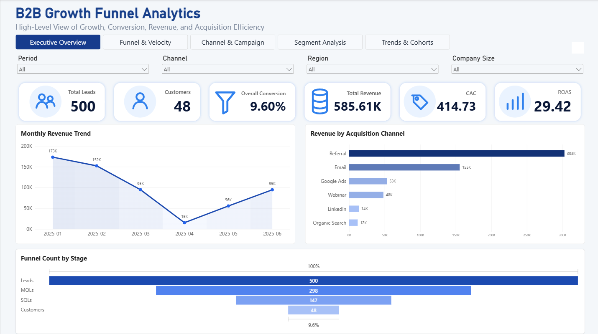
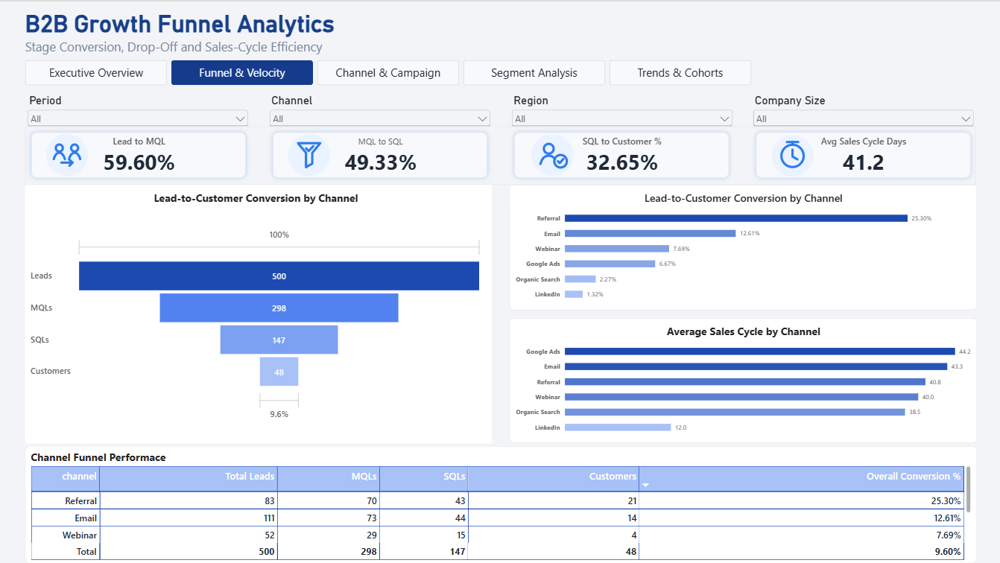
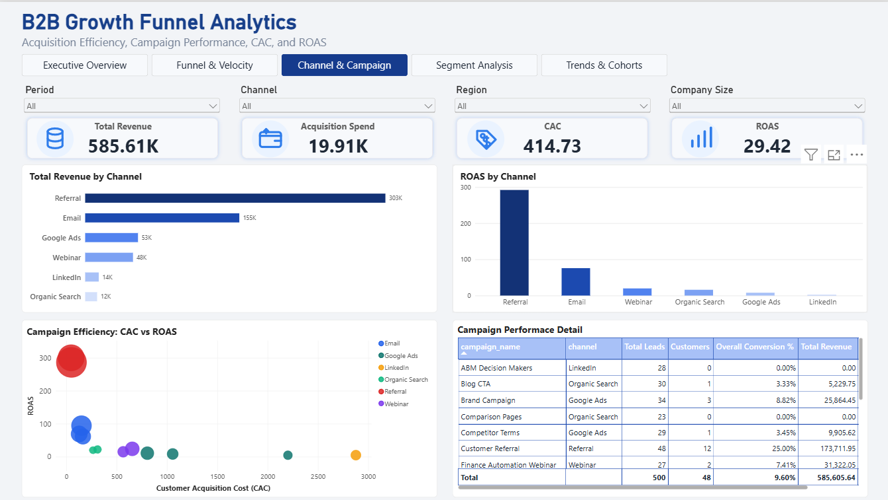
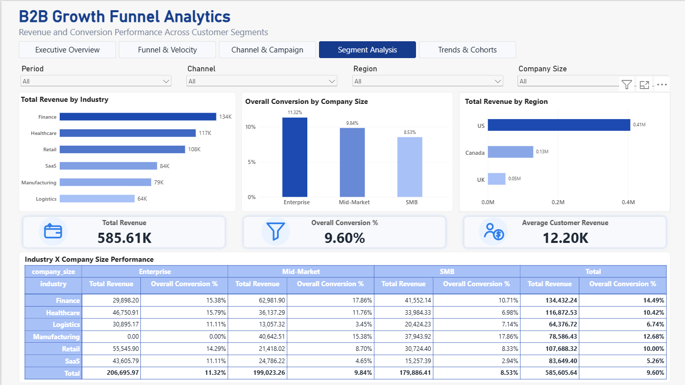
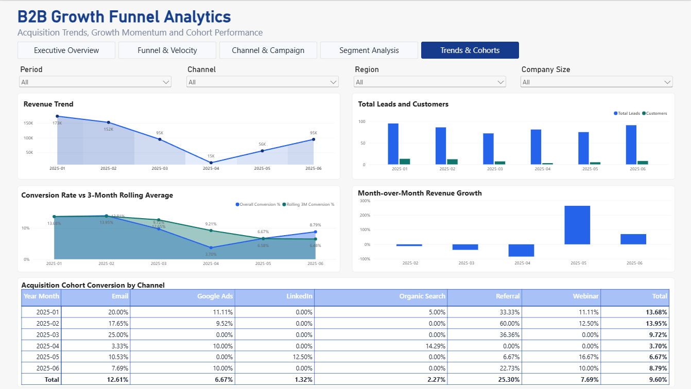
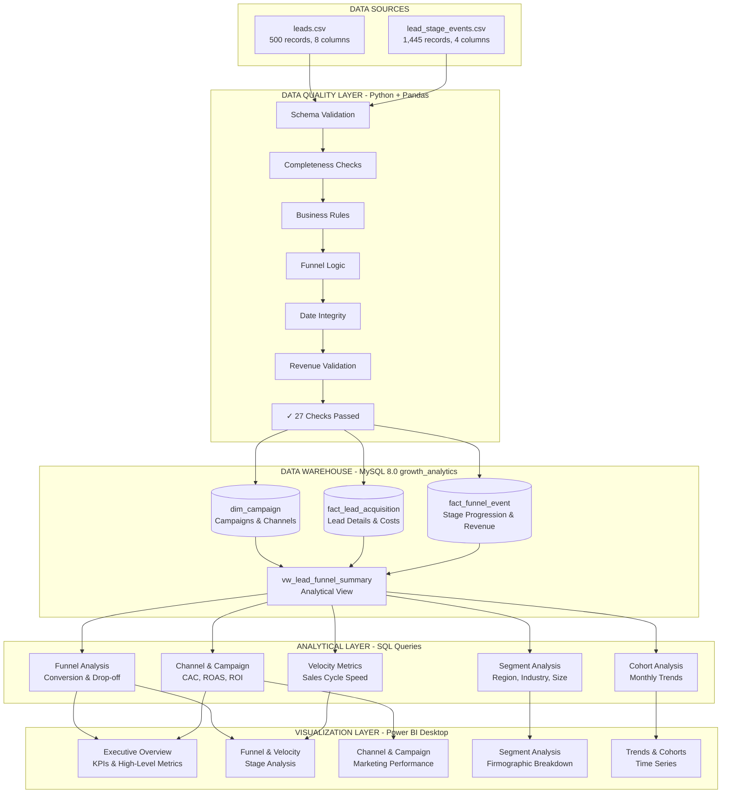
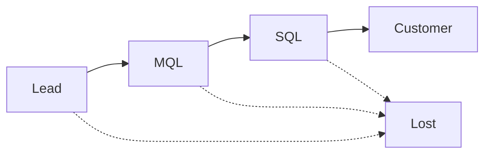
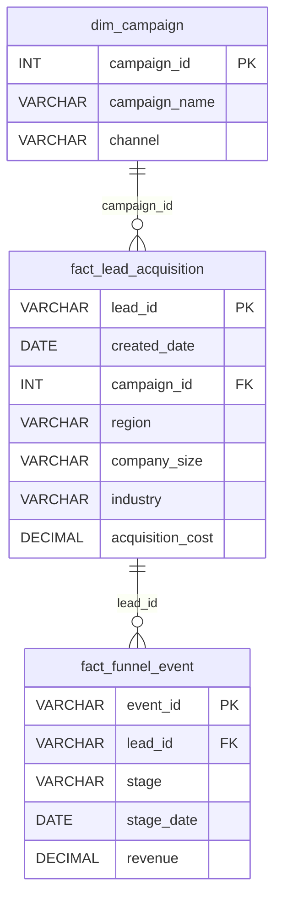
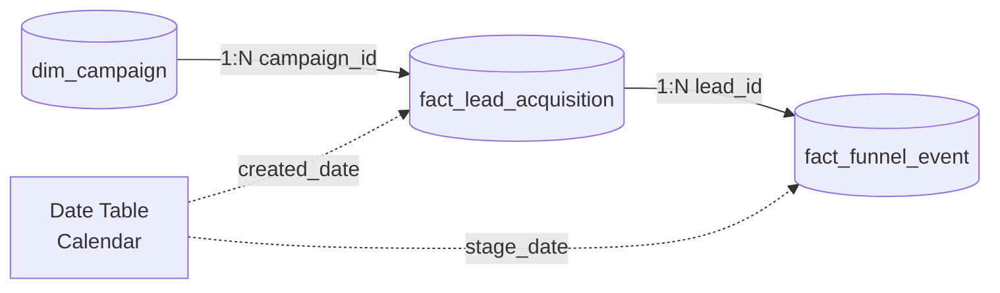

# B2B Growth Funnel & Marketing Efficiency Analytics


## Table of Contents
- [Business Problem](#business-problem)
- [Key Results](#key-results)
- [Dashboard Preview](#dashboard-preview)
- [Business Questions](#business-questions)
- [Architecture](#architecture)
- [Tech Stack](#tech-stack)
- [Dataset](#dataset)
- [Data Quality Process](#data-quality-process)
- [Database Model](#database-model)
- [SQL Analysis](#sql-analysis)
- [Power BI Model](#power-bi-model)
- [Key Insights](#key-insights)
- [Business Recommendations](#business-recommendations)
- [Repository Structure](#repository-structure)
- [How to Run](#how-to-run)
- [Skills Demonstrated](#skills-demonstrated)

---

## Business Problem

A B2B company acquires potential customers through multiple marketing channels including **Google Ads**, **LinkedIn**, **Email**, **Organic Search**, **Referrals**, and **Webinars**.

### Critical Challenges:
- **Lack of visibility** into which acquisition channels, campaigns, and customer segments generate qualified opportunities and revenue
- **No clear understanding** of where potential customers drop out in the Lead → MQL → SQL → Customer funnel
- **Missing insights** on sales cycle duration and funnel velocity
- **Inability to optimize** marketing spend and channel allocation

### Business Objective:
Build an **end-to-end analytics solution** that helps Marketing, Sales, and Revenue Operations understand acquisition efficiency, funnel performance, sales velocity, and revenue contribution.

---

## Key Results

| Metric | Value |
|--------|-------|
| **Total Leads Analyzed** | 500 |
| **Customers Acquired** | 48 |
| **Overall Conversion Rate** | 9.60% |
| **Total Revenue Generated** | $585.61K |
| **Average CAC** | $414.73 |
| **Portfolio ROAS** | 29.42 |
| **Funnel Stages Tracked** | 4 (Lead → MQL → SQL → Customer) |
| **Marketing Channels** | 6 |
| **Data Quality Issues** | 0 Critical |

### Top Performing Channel:
- **Referral** generates **$303K revenue** (52% of total) with highest ROAS
- **Email** shows strongest conversion rate and efficient CAC
- **Google Ads** has potential but requires optimization

---

## Dashboard Preview

### Executive Overview

*High-level view of growth, conversion, revenue, and acquisition efficiency*

### Funnel & Velocity Analysis

*Stage-by-stage funnel progression and sales cycle analysis*

### Channel & Campaign Performance

*Marketing channel ROI, CAC, and campaign ranking*

### Segment Analysis

*Performance breakdown by region, industry, and company size*

### Trends & Cohorts

*Monthly acquisition cohort performance and trends over time*

**[View Full Report PDF](reports/B2B_Growth_Funnel_Analytics_Report.pdf)**

---

## Business Questions

This analytics solution answers **10 critical business questions**:

### Marketing Efficiency
1. Which marketing channels generate the highest-quality leads?
2. Which campaigns generate the strongest customer conversion?
3. Which channels have the lowest customer acquisition cost (CAC)?
4. Which channels and campaigns generate the strongest ROAS?

### Funnel Performance
5. Where is the largest funnel drop-off occurring?
6. How long does it take leads to move through each sales stage?
7. Which customer segments convert most effectively?

### Strategic Optimization
8. Which industries, regions, and company sizes convert most effectively?
9. Are monthly acquisition cohorts improving over time?
10. Which campaigns should be scaled, optimized, or investigated?

---

## Architecture



---

## Tech Stack

### Data Processing
- **Python 3.12+** - Data validation and processing
- **Pandas** - Data manipulation and transformation
- **NumPy** - Numerical computations
- **Jupyter Notebooks** - Interactive data analysis

### Database
- **MySQL 8.0** - Relational data warehouse
- **SQLAlchemy** - Python-MySQL connectivity
- **PyMySQL** - MySQL database adapter

### Business Intelligence
- **Power BI Desktop** - Interactive dashboards and visualizations
- **DAX** - Advanced calculations and measures
- **Power Query** - Data transformation

### Development Tools
- **UV** - Python package manager
- **Git** - Version control
- **python-dotenv** - Environment configuration

---

## Dataset

### Source Files

#### `leads.csv` (500 rows, 8 columns)
Contains lead acquisition data with firmographic information and marketing attribution.

| Column | Type | Description |
|--------|------|-------------|
| `lead_id` | String | Unique identifier for each lead |
| `created_date` | Date | Date the lead entered the acquisition funnel |
| `channel` | String | Marketing acquisition channel |
| `campaign` | String | Marketing campaign associated with the lead |
| `region` | String | Geographic region of the lead |
| `company_size` | String | Customer company-size segment |
| `industry` | String | Customer industry |
| `acquisition_cost` | Decimal | Marketing cost to acquire the lead |

#### `lead_stage_events.csv` (1,445 rows, 4 columns)
Captures funnel stage progression events for each lead.

| Column | Type | Description |
|--------|------|-------------|
| `lead_id` | String | Lead associated with the event |
| `stage` | String | Funnel stage reached (Lead/MQL/SQL/Customer/Lost) |
| `stage_date` | Date | Date the stage event occurred |
| `revenue` | Decimal | Revenue recorded when lead becomes customer |

### Funnel Stage Definitions



- **Lead**: Initial acquired prospect
- **MQL**: Marketing Qualified Lead
- **SQL**: Sales Qualified Lead  
- **Customer**: Successfully converted lead
- **Lost**: Lead that did not convert

---

## ✅ Data Quality Process

### Validation Framework
Implemented a **comprehensive 27-checkpoint validation system** covering:

#### 1. Schema Validation
- Required column presence
- Data type validation
- Unexpected column detection

#### 2. Completeness Checks
- Missing value detection
- Required field validation
- Data coverage assessment

#### 3. Business Rule Validation
- Every lead must start with "Lead" stage
- Only one initial Lead event per lead
- Valid funnel stages only

#### 4. Funnel Logic Validation
- Correct stage progression (Lead → MQL → SQL → Customer)
- No duplicate stage events per lead
- Prerequisite stages validation
- Mutually exclusive terminal outcomes
- Single terminal event per lead

#### 5. Date Integrity
- Valid date formats
- Events cannot precede lead creation
- Chronological ordering

#### 6. Revenue Validation
- Revenue only on Customer events
- All customers have positive revenue
- No negative revenue values

#### 7. Relationship Integrity
- No orphan events
- All leads have events
- Foreign key validation

### Quality Report Results
✅ **ALL 27 CRITICAL CHECKS PASSED**

**[View Full Quality Report](reports/data_quality_report.csv)**

---

## Database Model

### Schema: `growth_analytics`

#### Entity-Relationship Diagram


### Table Descriptions

#### `dim_campaign`
**Purpose**: Campaign dimension table storing marketing channel and campaign information.

| Column | Type | Constraints | Description |
|--------|------|------------|-------------|
| `campaign_id` | INT | PRIMARY KEY | Surrogate primary key |
| `campaign_name` | VARCHAR(100) | NOT NULL | Campaign name |
| `channel` | VARCHAR(50) | NOT NULL | Acquisition channel |

**Constraints**: UNIQUE (campaign_name, channel)

---

#### `fact_lead_acquisition`
**Purpose**: Lead acquisition fact table with firmographic attributes and cost tracking.

| Column | Type | Constraints | Description |
|--------|------|------------|-------------|
| `lead_id` | VARCHAR(20) | PRIMARY KEY | Unique lead identifier |
| `created_date` | DATE | NOT NULL | Lead acquisition date |
| `campaign_id` | INT | FOREIGN KEY | References dim_campaign |
| `region` | VARCHAR(50) | NOT NULL | Lead region |
| `company_size` | VARCHAR(50) | NOT NULL | Company-size segment |
| `industry` | VARCHAR(100) | NOT NULL | Lead industry |
| `acquisition_cost` | DECIMAL(10,2) | NOT NULL | Acquisition cost |

**Indexes**: campaign_id, created_date

---

#### `fact_funnel_event`
**Purpose**: Funnel stage progression event tracking.

| Column | Type | Constraints | Description |
|--------|------|------------|-------------|
| `event_id` | VARCHAR(20) | PRIMARY KEY | Unique event identifier |
| `lead_id` | VARCHAR(20) | FOREIGN KEY | References fact_lead_acquisition |
| `stage` | VARCHAR(20) | NOT NULL | Funnel stage |
| `stage_date` | DATE | NOT NULL | Date stage was reached |
| `revenue` | DECIMAL(12,2) | NULL | Revenue (Customer events only) |

**Indexes**: lead_id, stage, stage_date

---

#### `vw_lead_funnel_summary` (Analytical View)
**Purpose**: Pre-aggregated view combining lead, campaign, and funnel progression for analysis.

**Key Columns**:
- Lead attributes (id, created_date, region, industry, company_size)
- Campaign attributes (campaign_name, channel)
- Cost metrics (acquisition_cost)
- Funnel flags (became_mql, became_sql, became_customer, became_lost)
- Stage dates (mql_date, sql_date, customer_date, lost_date)
- Revenue (revenue)

---

## SQL Analysis

### Analysis Modules

#### **1. Schema & Setup** (`01_schema.sql`)
- Database and table creation
- Primary and foreign key constraints
- Index optimization
- Data integrity rules

#### **2. Analytics Views** (`02_analytics_views.sql`)
- `vw_lead_funnel_summary`: Core analytical view
- Combines all dimensions and facts
- Funnel progression indicators
- Ready for BI consumption

#### **3. Funnel Analysis** (`03_funnel_analysis.sql`)
Answers:
- Q1: Overall funnel volume and conversion rates
- Q2: Stage-by-stage drop-off analysis
- Q3: Funnel conversion by channel
- Q4: Overall funnel velocity (days between stages)
- Q5: Sales-cycle speed by channel
- Q6: Slowest converting successful segments

**Sample Output**: Overall Conversion Rate = 9.60%

#### **4. Channel & Campaign Analysis** (`04_channel_campaign_analysis.sql`)
Answers:
- Q1: Channel economics (CAC, ROAS, revenue per lead)
- Q2: Campaign performance across all metrics
- Q3: Campaign rankings within each channel
- Q4: Campaign performance profiles (2x2 matrix)
- Q5: Revenue concentration by channel
- Q6: Channel performance vs. portfolio average

**Key Metrics**: CAC, ROAS, Conversion Rate, Revenue per Lead

#### **5. Segment Analysis** (`05_segment_analysis.sql`)
Analyzes performance by:
- Industry vertical
- Geographic region
- Company size segment
- Multi-dimensional combinations

Identifies high-performing segments for targeting.

#### **6. Trend & Cohort Analysis** (`06_trend_cohort_analysis.sql`)
- Monthly acquisition trends
- Cohort-based performance tracking
- Time-series conversion analysis
- Period-over-period comparisons

---

## Power BI Model

### Data Model Architecture


### Key Measures (DAX)

#### Volume Metrics
```dax
Total Leads = COUNTROWS(fact_lead_acquisition)
Total Customers = CALCULATE(COUNTROWS(fact_funnel_event), fact_funnel_event[stage] = "Customer")
Total MQLs = CALCULATE(COUNTROWS(fact_funnel_event), fact_funnel_event[stage] = "MQL")
Total SQLs = CALCULATE(COUNTROWS(fact_funnel_event), fact_funnel_event[stage] = "SQL")
```

#### Conversion Metrics
```dax
Overall Conversion Rate = 
    DIVIDE([Total Customers], [Total Leads], 0)

Lead to MQL Rate = 
    DIVIDE([Total MQLs], [Total Leads], 0)

MQL to SQL Rate = 
    DIVIDE([Total SQLs], [Total MQLs], 0)

SQL to Customer Rate = 
    DIVIDE([Total Customers], [Total SQLs], 0)
```

#### Financial Metrics
```dax
Total Revenue = 
    SUMX(FILTER(fact_funnel_event, fact_funnel_event[stage] = "Customer"), 
         fact_funnel_event[revenue])

Total Acquisition Spend = 
    SUM(fact_lead_acquisition[acquisition_cost])

CAC = 
    DIVIDE([Total Acquisition Spend], [Total Customers], 0)

ROAS = 
    DIVIDE([Total Revenue], [Total Acquisition Spend], 0)

Revenue per Lead = 
    DIVIDE([Total Revenue], [Total Leads], 0)
```

#### Velocity Metrics
```dax
Avg Days Lead to MQL = 
    AVERAGEX(
        FILTER(fact_funnel_event, fact_funnel_event[stage] = "MQL"),
        DATEDIFF([Lead Created Date], [Stage Date], DAY)
    )

Avg Sales Cycle (Days) = 
    CALCULATE(
        AVERAGEX(fact_funnel_event, [Days in Funnel]),
        fact_funnel_event[stage] = "Customer"
    )
```

### Dashboard Pages

1. **Executive Overview**: KPIs, trends, and high-level funnel
2. **Funnel & Velocity**: Stage progression and cycle time analysis
3. **Channel & Campaign**: Marketing ROI and efficiency metrics
4. **Segment Analysis**: Performance by firmographics
5. **Trends & Cohorts**: Time-based performance tracking

### Interactive Features
- Cross-page filtering
- Dynamic slicers (Period, Channel, Region, Company Size)
- Drill-through capabilities
- Custom tooltips
- Conditional formatting

---

## Key Insights

### 1. Channel Performance Disparities
- **Referral** dominates with **52% of total revenue** ($303K) despite only 18% of leads
- **Email** shows highest conversion efficiency with strong ROAS
- **Google Ads** underperforms with high CAC and low conversion

### 2. Funnel Bottlenecks Identified
- **Biggest drop-off**: MQL → SQL stage (50.5% drop)
- **Lead to MQL**: 59.6% conversion (relatively strong)
- **SQL to Customer**: 32.7% conversion (opportunity for improvement)
- Overall funnel efficiency: **9.6% lead-to-customer conversion**

### 3. Revenue Concentration Risk
- **Top 2 channels** (Referral + Email) generate **77% of revenue**
- Portfolio heavily dependent on referral pipeline
- Need to diversify revenue sources

### 4. Segment Performance Variations
- **Enterprise** segment shows highest revenue per customer
- **Mid-Market** has best conversion rate
- **Healthcare** and **Financial Services** are top-performing industries
- **North America** leads in volume and revenue

### 5. Sales Cycle Insights
- **Average sales cycle**: 45-60 days from Lead to Customer
- **Referral** channel has fastest velocity
- **Organic Search** shows longest conversion time
- MQL → SQL stage takes longest (median 21 days)

### 6. Cohort Trends
- **Recent cohorts** (May-June 2025) show improving conversion rates
- Revenue per lead trending upward
- Customer acquisition improving month-over-month

---

## Business Recommendations

### Immediate Actions (0-30 days)

#### 1. **Double Down on Referral & Email**
- **Action**: Increase budget allocation to Referral and Email by 30%
- **Rationale**: Combined ROAS of 40+, proven conversion
- **Expected Impact**: 15-20% revenue increase

#### 2. **Optimize Google Ads Campaigns**
- **Action**: Audit Google Ads campaigns with <5% conversion
- **Focus**: Improve targeting, landing pages, and qualification criteria
- **Goal**: Reduce CAC by 25% or reallocate budget

#### 3. **Fix MQL → SQL Bottleneck**
- **Action**: Implement lead scoring and sales enablement program
- **Target**: Improve MQL-SQL conversion from 49.5% to 60%
- **Tactics**: Better qualification criteria, sales training

### Strategic Initiatives (30-90 days)

#### 4. **Segment-Focused Campaigns**
- **Action**: Launch targeted campaigns for:
  - Healthcare & Financial Services industries
  - Enterprise segment in North America
  - Mid-Market companies (highest conversion)
- **Expected Impact**: 20% increase in qualified pipeline

#### 5. **Velocity Improvement Program**
- **Action**: Reduce average sales cycle from 52 to 42 days
- **Tactics**:
  - Automate MQL nurturing
  - Implement SQL fast-track process
  - Weekly pipeline reviews
- **Impact**: 25% increase in quarterly revenue

#### 6. **Revenue Diversification**
- **Action**: Test and scale:
  - **LinkedIn** campaigns (currently underperforming)
  - **Webinar** programs with better follow-up
  - **Organic Search** SEO investment
- **Goal**: Reduce dependency on Referral to <40% of revenue

### Long-term Optimization (90+ days)

#### 7. **Predictive Lead Scoring**
- Implement ML-based lead scoring using conversion patterns
- Prioritize high-propensity leads for faster follow-up

#### 8. **Attribution Modeling**
- Build multi-touch attribution model
- Understand channel interaction effects
- Optimize budget allocation across customer journey

#### 9. **Expansion Opportunities**
- Launch account-based marketing for Enterprise segment
- Develop industry-specific value propositions
- Test new channels (Partnerships, Events)

---

## Repository Structure

```
b2b-growth-funnel-analytics/
│
├── data/                           # Data directory
│   ├── raw/                        # Original source files
│   │   ├── leads.csv               # Lead acquisition data (500 records)
│   │   └── lead_stage_events.csv  # Funnel event data (1,445 records)
│   │
│   └── processed/                  # Cleaned and validated data
│       ├── clean_leads.csv
│       └── clean_funnel_events.csv
│
├── notebooks/                      # Jupyter notebooks for analysis
│   ├── 01_data_audit.ipynb        # Data profiling and quality assessment
│   ├── 02_data_validation_processing.ipynb  # Data cleaning pipeline
│   └── 03_mysql_database_ingestion.ipynb    # Database loading
│
├── sql/                            # SQL scripts for analytics
│   ├── 01_schema.sql              # Database schema and tables
│   ├── 02_analytics_views.sql     # Analytical views
│   ├── 03_funnel_analysis.sql     # Funnel conversion analysis
│   ├── 04_channel_campaign_analysis.sql  # Marketing performance
│   ├── 05_segment_analysis.sql    # Segment-based analysis
│   └── 06_trend_cohort_analysis.sql      # Time-series and cohorts
│
├── powerbi/                        # Power BI assets
│   ├── b2b_growth_funnel_analytics.pbix    # Power BI dashboard
│   ├── b2b_growth_analytics_theme.json     # Custom theme
│   └── screenshots/                # Dashboard screenshots
│       ├── 1_executive_overview.png
│       ├── 2_funnel_&_velocity.png
│       ├── 3_channel_&_campaigns.png
│       ├── 4_segment_analysis.png
│       └── 5_trends_&_cohorts.png
│
├── reports/                        # Generated reports
│   ├── data_quality_report.csv    # Quality validation results
│   └── B2B_Growth_Funnel_Analytics_Report.pdf  # Full analytical report
│
├── docs/                           # Documentation
│   ├── business_case.md           # Business requirements and objectives
│   ├── data_model.md              # Database schema documentation
│   └── data_dictionary.md         # Data definitions and terminology
│
├── .env.example                    # Example environment configuration
├── .gitignore                      # Git ignore rules
├── pyproject.toml                  # Python project configuration
├── uv.lock                         # UV lock file
└── README.md                       # This file
```

---

## How to Run

### Prerequisites
- **Python 3.12+**
- **MySQL 8.0+**
- **Power BI Desktop** (latest version)
- **UV package manager** (or pip)

### Step 1: Clone the Repository
```bash
git clone https://github.com/yourusername/b2b-growth-funnel-analytics.git
cd b2b-growth-funnel-analytics
```

### Step 2: Set Up Python Environment
```bash
# Using UV (recommended)
uv venv
uv pip install -e .

# Or using pip
python -m venv .venv
.venv\Scripts\activate  # Windows
source .venv/bin/activate  # Linux/Mac
pip install -e .
```

### Step 3: Configure Database Connection
```bash
# Copy example environment file
copy .env.example .env

# Edit .env with your MySQL credentials
# DB_HOST=localhost
# DB_PORT=3306
# DB_USER=your_username
# DB_PASSWORD=your_password
# DB_NAME=growth_analytics
```

### Step 4: Run Data Quality Validation
```bash
# Open Jupyter Lab
jupyter lab

# Run notebooks in order:
# 1. notebooks/01_data_audit.ipynb
# 2. notebooks/02_data_validation_processing.ipynb
```

### Step 5: Set Up MySQL Database
```bash
# Create database
mysql -u root -p -e "CREATE DATABASE growth_analytics;"

# Run SQL scripts in order
mysql -u root -p growth_analytics < sql/01_schema.sql
mysql -u root -p growth_analytics < sql/02_analytics_views.sql
```

### Step 6: Load Data into MySQL
```bash
# Run database ingestion notebook
jupyter lab notebooks/03_mysql_database_ingestion.ipynb
```

### Step 7: Run SQL Analysis
```bash
# Execute analysis queries
mysql -u root -p growth_analytics < sql/03_funnel_analysis.sql
mysql -u root -p growth_analytics < sql/04_channel_campaign_analysis.sql
mysql -u root -p growth_analytics < sql/05_segment_analysis.sql
mysql -u root -p growth_analytics < sql/06_trend_cohort_analysis.sql
```

### Step 8: Open Power BI Dashboard
```bash
# Open Power BI file
start powerbi/b2b_growth_funnel_analytics.pbix

# Update data source connection:
# 1. Transform Data → Data Source Settings
# 2. Update MySQL connection string
# 3. Enter credentials
# 4. Refresh data
```

### Verification Steps
1. **Data Quality**: Check `reports/data_quality_report.csv` - all checks should pass
2. **Database**: Verify 500 leads and 1,445 events loaded
3. **Views**: Confirm `vw_lead_funnel_summary` has 500 rows
4. **Power BI**: All visuals should render without errors

---

## Skills Demonstrated

### Data Engineering
✅ **ETL Pipeline Development**: End-to-end data extraction, transformation, and loading  
✅ **Data Quality Framework**: Comprehensive validation with 27 checkpoint system  
✅ **Database Design**: Star schema with dimensional modeling  
✅ **Data Modeling**: Fact and dimension table design with proper relationships  
✅ **SQL Programming**: Advanced queries with CTEs, window functions, and aggregations

### Analytics & Business Intelligence
✅ **Funnel Analysis**: Multi-stage conversion tracking and drop-off identification  
✅ **Cohort Analysis**: Time-based performance tracking and trend analysis  
✅ **Segmentation**: Multi-dimensional performance analysis  
✅ **Marketing Analytics**: CAC, ROAS, and channel efficiency metrics  
✅ **Sales Analytics**: Velocity metrics and cycle time analysis

### Visualization & Reporting
✅ **Power BI Development**: 5 interactive dashboards with advanced DAX  
✅ **DAX Calculations**: Complex measures for conversion, revenue, and velocity  
✅ **Dashboard Design**: User-centric design with clear information hierarchy  
✅ **Data Storytelling**: Translating data into actionable insights  
✅ **Executive Reporting**: Clear communication of findings and recommendations

### Technical Skills
✅ **Python**: Pandas, NumPy, data validation frameworks  
✅ **SQL**: MySQL, query optimization, views, and indexes  
✅ **Business Intelligence**: Power BI, DAX, Power Query  
✅ **Data Visualization**: Chart selection, visual design, UX principles  
✅ **Git**: Version control and documentation

### Business Acumen
✅ **Stakeholder Alignment**: Understanding marketing, sales, and operations needs  
✅ **KPI Definition**: Identifying and tracking relevant business metrics  
✅ **Strategic Thinking**: Data-driven recommendations with business impact  
✅ **Problem Solving**: Root cause analysis and solution design  
✅ **Communication**: Translating technical findings for business audiences

---

## Contact

**Rohit Kumar**  
Email: rohitkr7518@gmail.com  
[LinkedIn](https://linkedin.com/in/rohitkmr8527) | [GitHub](https://github.com/rohitkr8527)

---

## License

This project is open source and available under the [MIT License](LICENSE).

---

## Acknowledgments

- Dataset structure inspired by real-world B2B SaaS companies
- Dashboard design follows Microsoft Power BI best practices
- SQL patterns based on Kimball dimensional modeling methodology

---

<div align="center">

**⭐ If you found this project helpful, please consider giving it a star!**

</div>
